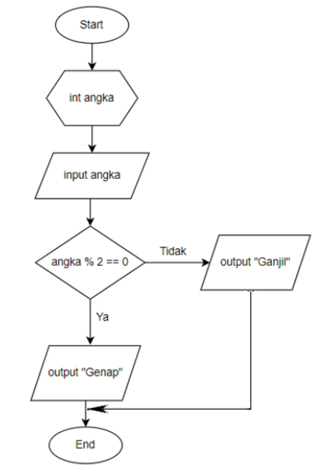

# JOBSHEET 5

# PERCOBAAN

## - Percobaan 1 : Penerapan IF dan IF-ELSE untuk Mencetak KRS

_Pertanyaan:_

1. Mengapa pengecekan pada struktur IF tersebut tidak melibatkan kondisi dengan
operator relasional? 
2. Saat program dijalankan, kemudian Anda mengisikan nilai false, bagaimana hasilnya?
3. Sistem perlu memberikan informasi apabila pengguna memasukkan nilai false, maka
terdapat keluaran “Registrasi ditolak. Silakan lunasi UKT terlebih dahulu”. Modifikasi
program tersebut dengan menambahkan struktur ELSE!
4. Commit dan push hasil modifikasi Anda ke Github dengan pesan “Modifikasi
Percobaan 1”

_Jawaban:_

1. Pengecekan pada struktur IF tersebut tidak melibatkan operator relasional karena Variabel yang dicek (uktLunas) sudah bertipe boolean, sehingga langsung bisa digunakan sebagai kondisi tanpa perlu dibandingkan lagi.
2. Jika nilai yang dimasukkan adalah false, maka tidak ada output tambahan dari blok if — program langsung selesai setelah input, karena uktLunas bernilai false.
3. Menambahkan code 
   ```java 
        else{
            System.out.println("Registrasi ditolak. Silakan lunasi UKT terlebih dahulu");
        }
   ```
4. Jobsheet 5 "Pemilihan" Percobaan 1

## - Percobaan 2 : SWITCH-CASE untuk Mencetak KRS

_Pertanyaan:_

1. Apa fungsi dari sintaks break?
2. Apa peran dari sintaks default pada struktur pemilihan SWITCH-CASE?
3. Buat file baru dengan nama ifElseCetakKRSNoPresensi.java. File ini berisi program hasil
transformasi dari program cetak KRS menggunakan struktur SWITCH-CASE yang telah
dibuat ke dalam bentuk IF-ELSE IF-ELSE.
4. Commit dan push hasil modifikasi Anda ke Github dengan pesan “Modifikasi Percobaan 2”

_Jawaban:_

1. _break_ berfungsi untuk menghentikan eksekusi switch-case setelah satu kondisi terpenuhi, agar program tidak menjalankan case-case berikutnya secara berurutan.
2. _default_ berfungsi untuk menangani semua nilai yang tidak sesuai dengan case yang ada, sehingga program tetap bisa memberikan respon yang logis dan tidak berhenti begitu saja.
3. Membuat file baru dengan nama ifElseCetakKRS4.java dalam bentuk IF-ELSE IF-ELSE
   ```java 
         //struktur pemilihan IF-ELSE IF-ELSE untuk mengecek semester saat ini
        if (semester == 1) {
                System.out.println("KRS Semester 1 ditampilkan");
        } else if (semester == 2) {
                System.out.println("KRS Semester 2 ditampilkan");
        } else if (semester == 3) {
                System.out.println("KRS Semester 3 ditampilkan");
        } else if (semester == 4) {
                System.out.println("KRS Semester 4 ditampilkan");
        } else if (semester == 5) {
                System.out.println("KRS Semester 5 ditampilkan");
        } else if (semester == 6) {
                System.out.println("KRS Semester 6 ditampilkan");
        } else if (semester == 7) {
                System.out.println("KRS Semester 7 ditampilkan");
        } else if (semester == 8) {
                System.out.println("KRS Semester 8 ditampilkan");
        } else {
            System.out.println("Semester tidak valid");
        }
   ```
4. Jobsheet 5 "Pemilihan" Percobaan 2

## Percobaan 3 : Nested IF untuk Mengecek Syarat Ujian Skripsi

_Pertanyaan:_

1. Apa yang terjadi jika mahasiswa menjawab "No" pada pertanyaan bebas kompen?
Mengapa demikian?
2. Jelaskan maksud dari potongan kode berikut!
   ```java 
         if (bimbinganP1 >= 8 && bimbinganP2 >= 4) 
   ```
3. Bagaimana alur pemeriksaan syarat mahasiswa dari awal sampai akhir? Jelaskan secara
runtut untuk semua kondisi!

_Jawaban:_

1. Jadi, jika mahasiswa menjawab "No" (atau “Tidak”), maka kondisi bebasKompen.equalsIgnoreCase("Ya") bernilai false.
Karena itu, program langsung masuk ke bagian else, sehingga pesan yang ditampilkan adalah : Gagal! Mahasiswa masih memiliki tanggungan kompen.
2. Kode if (bimbinganP1 >= 8 && bimbinganP2 >= 4) digunakan untuk memastikan mahasiswa sudah memenuhi syarat minimal log bimbingan pada kedua pembimbing sebelum dinyatakan lulus atau berhasil mendaftar ujian skripsi.
Log bimbingan = jumlah pertemuan atau catatan kegiatan bimbingan antara mahasiswa dan dosen pembimbing yang digunakan sebagai bukti dan syarat kelulusan bimbingan skripsi.

3. Alur pemeriksaan syarat mahasiswa dari awal sampai akhir :
   1.	Program mulai dan minta input “Apakah mahasiswa sudah bebas kompen? (Ya/Tidak)”.
   2.	Jika menjawab “Tidak” output Gagal! Mahasiswa masih memiliki tanggungan kompen
   3.	Jika menjawab “Ya”  lanjut mengisi jumlah log bimbingan.
   4.	Program memeriksa:
    - Apakah log bimbingan P1 ≥ 8
    - Dan log bimbingan P2 ≥ 4
   5.	Jika dua-duanya memenuhi “Semua syarat terpenuhi. Mahasiswa boleh mendaftar ujian skripsi”
   6.	Jika dua-duanya kurang pesan = "Gagal! Log bimbingan P1 kurang dari 8 kali dan P2 kurang dari 4 kali"
   7.	Jika P1 saja kurang  pesan = "Gagal! Log bimbingan P1 belum mencapai 8 kali"
   8.	Jika P2 saja kurang pesan = "Gagal! Log bimbingan P2 belum mencapai 4 kali"

# TUGAS

## Tugas 1

Buka kembali file ifCetakKRSNoPresensi.java, tambahkan baris baru di dalam fungsi main
untuk melakukan transformasi program cetak KRS hasil modifikasi menggunakan struktur
IF-ELSE yang telah dibuat ke dalam bentuk Ternary Operator! Commit dan push program
Anda ke Github dengan pesan “Tugas 1”

## Jawaban

```java 
      //modifikasi menggunakan struktur IF-ELSE yang telah dibuat ke dalam bentuk Ternary Operator
        String hasil = uktLunas
        ? "Pembayaran UKT terverifikasi\nSilakan cetak KRS dan minta tanda tangan DPA"
        : "Registrasi ditolak. Silakan lunasi UKT terlebih dahulu";

        System.out.println("\n--- Hasil dengan Ternary Operator ---");
        System.out.println(hasil);
```

## Tugas 2

Perhatikan flowchart berikut.

Implementasikan flowchart tersebut ke dalam kode program Java dengan struktur
pemilihan IF-ELSE! Commit dan push program Anda ke Github dengan pesan “Tugas 2”

## Jawaban

```java 
      import java.util.Scanner;

      public class tugas2Pemilihan {
         public static void main(String[] args) {
            Scanner sc = new Scanner(System.in);

            System.out.print("Masukkan sebuah angka : ");
            int angka = sc.nextInt();

             //struktur pemilihan IF-ELSE
            if (angka % 2 == 0) {
                System.out.println("Angka tersebut adalah Genap");
            } else {
                System.out.println("Angka tersebut adalah Ganjil");
            }
            sc.close();
    }
    
}
```

## Tugas 3 

Implementasikan flowchart yang telah Anda buat untuk Latihan pada Tugas pertemuan
5 Matakuliah Dasar Pemrograman terkait sistem perpustakaan dan akses WIFI kampus
ke dalam kode program! Commit dan push program Anda ke Github dengan pesan
“Tugas 3”

## Jawaban 

Code Sistem perpustakaan 
```java 
      import java.util.Scanner;

      public class tugas3SistemPerpustakaan {
          public static void main(String[] args) {
            Scanner input = new Scanner(System.in);

            boolean membawaKartuMahasiswa;
            boolean sudahRegistrasiOnline;

            System.out.print("Apakah membawa kartu mahasiswa? (true/false) : ");
            membawaKartuMahasiswa = input.nextBoolean();

            System.out.print("Apakah sudah registrasi online? (true/false) : ");
            sudahRegistrasiOnline = input.nextBoolean();

            //struktur IF dengan logika OR (||)
            if (membawaKartuMahasiswa == true || sudahRegistrasiOnline == true) {
               System.out.println("Boleh masuk");
            } else {
               System.out.println("Tidak boleh masuk");
            }
            input.close();
      }
}
```

Code Akses WiFi Kampus 
```java 
      import java.util.Scanner;

      public class tugas3AksesWiFiKampus {
         public static void main(String[] args) {
            Scanner input = new Scanner(System.in);
            String user;
            int sks;

            System.out.print("Masukkan jenis user (dosen/mahasiswa) : ");
            user = input.nextLine();

            if (user.equalsIgnoreCase("dosen")){
               System.out.println("Akses WiFi diberikan (dosen)");
            } else if (user.equalsIgnoreCase("mahasiswa")){
               System.out.print("Masukkan jumlah SKS: ");
               sks = input.nextInt();

               if (sks >= 12) {
                  System.out.println("Akses WiFi diberikan (mahasiswa aktif)");
               } else {
                  System.out.println("Akses WiFi ditolak, SKS kurang dari 12");
               }
            } else {
               System.out.println("Akses ditolak");
            }
            input.close();
      } 
}
```


